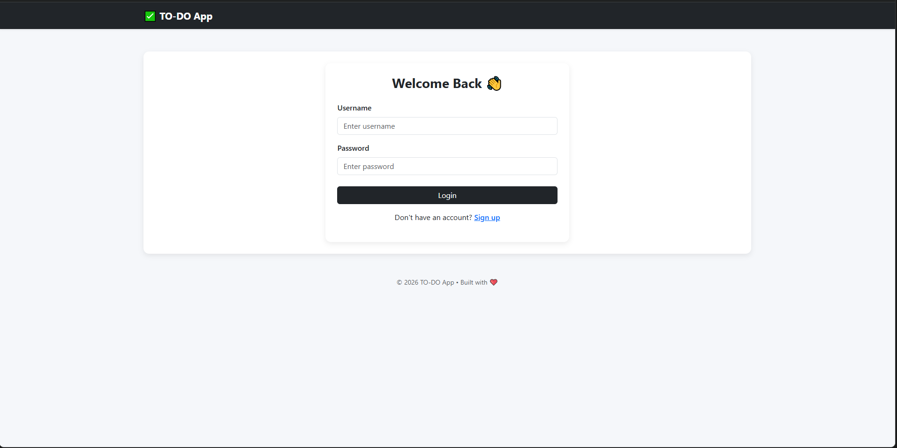
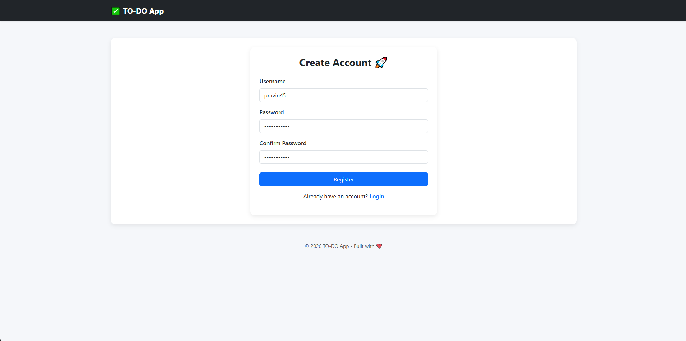
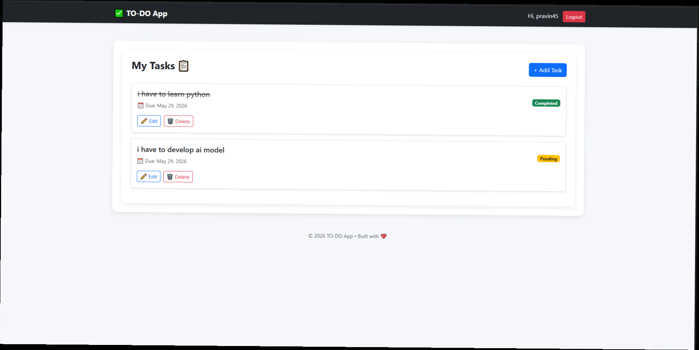

A simple and modern Task Management Web Application built using Django and Bootstrap.

Login

user registration

adding task 

FEATURES

User Registration and Login
Secure Authentication (Login Required)
Add, Update, Delete Tasks
Mark tasks as Completed or Pending
User-specific task management
Clean modern UI using Bootstrap
Secure logout using POST request

TECH STACK

Backend: Django (Python)
Frontend: HTML, CSS, Bootstrap
Database: SQLite

PROJECT STRUCTURE
todo_project/
todo_app/
    models.py
    views.py
    urls.py

    templates/
        base.html
        login.html
        register.html
        task_list.html
        add_task.html
        update_task.html

manage.py

INSTALLATION

Clone the repository

git clone https://github.com/AvinashG8857/Django/tree/8efa0a4db9b75c70ad87fc3d26e877bc8c6264ee/Todo%20app%20website
cd todo-app

Create virtual environment

python -m venv venv
venv\Scripts\activate

Install dependencies

pip install django

Apply migrations

python manage.py makemigrations
python manage.py migrate

Run server

python manage.py runserver
Open in browser:
http://127.0.0.1:8000/

AUTHENTICATION FLOW

Register a new account
Login using credentials
Access your task dashboard
Logout securely

URL ROUTES
/                  → Task List
/add/              → Add Task
/update//      → Update Task
/delete//      → Delete Task
/login/            → Login Page
/register/         → Register Page
/logout/           → Logout

SECURITY FEATURES

Login required for all task operations
User-based data filtering
CSRF protection enabled
Secure logout using POST request

UI FEATURES

Responsive layout
Card-based design
Clean navigation bar
Task status badges (Completed / Pending)

FUTURE IMPROVEMENTS

Task search and filtering
Priority system
Dark mode
Notifications and alerts
Dashboard analytics

AUTHOR
Avinash Goud

LICENSE
This project is open-source and free to use