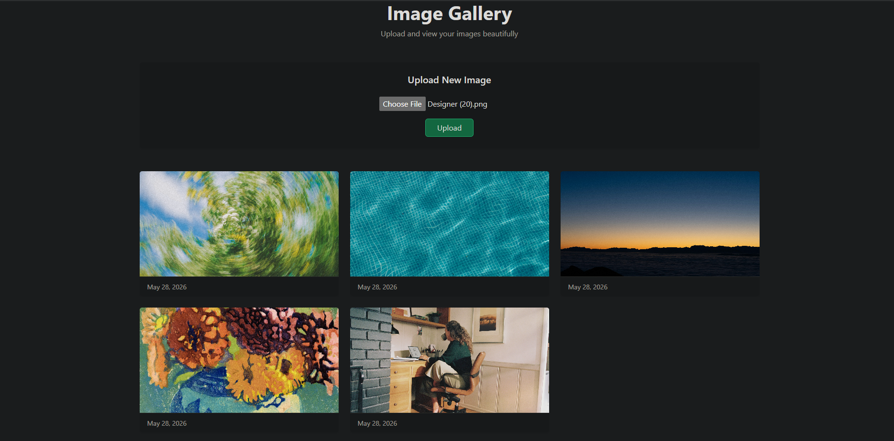

Django Image Uploader

A simple and clean image upload and gallery web application built with Django and Bootstrap 5. Users can upload images and view them in a responsive gallery layout.

-----------------------------------------------------

FEATURES

- Upload images using a form
- Display uploaded images in a gallery layout
- Responsive UI with Bootstrap
- Beginner-friendly Django structure
- Media file handling with Django

-----------------------------------------------------

TECHNOLOGIES USED

- Python 3
- Django
- HTML5
- Bootstrap 5

-----------------------------------------------------

PROJECT STRUCTURE

image-uploader/

│
├── uploader/
│   ├── migrations/
│   ├── templates/
│   │   └── index.html
│   ├── models.py
│   ├── views.py
│   ├── forms.py
│   └── urls.py
│
├── media/
├── db.sqlite3
├── manage.py
└── settings.py

-----------------------------------------------------

INSTALLATION & SETUP

1. Clone the repository

git clone https://github.com/your-username/image-uploader.git
cd image-uploader

2. Create virtual environment (Windows)

python -m venv venv
venv\Scripts\activate

3. Install dependencies

pip install django

4. Run migrations

python manage.py makemigrations
python manage.py migrate

5. Run the server

python manage.py runserver

6. Open in browser

http://127.0.0.1:8000/

-----------------------------------------------------

